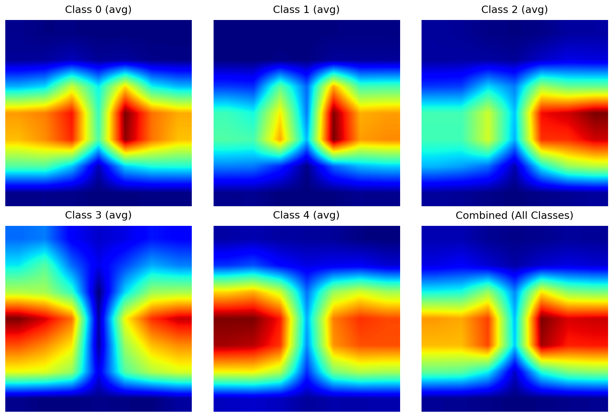
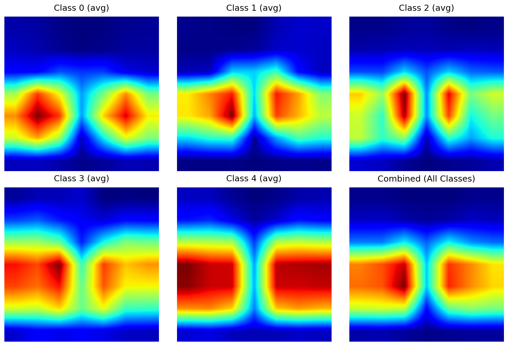

## KW18 - 30 April 2026

### Decision: Initial project setup
We created the private repository for Topic H1+H2: XAI-Guided Training for Knee Osteoarthritis Grading. The project investigates whether saliency maps can identify knee X-ray cases where a CNN predicts the correct Kellgren–Lawrence grade for the wrong reason, and whether those cases can guide improved training.

### Decision: Dataset plan
We will use provided SilpaCS/kneeosteoarthritis dataset from Hugging Face. As a first step, we will inspect the dataset structure, class distribution across KL grades 0–4, image dimensions, and possible artifacts such as borders, cropping effects, or scanner marks.

## KW19 - 8 May 2026

### Decision: Dataset setup and inspection

We downloaded and extracted the dataset. We generated a class distribution plot and one sample image per class. Inspection is needed because the documentation states that the dataset has an imbalanced class distribution and pre-cropped images, that can affect model evaluation and saliency-map interpretation.

The initial audit showed that sampled images are consistently 224×224 pixels. The observed class distribution is imbalanced, with KL grade 0 being the largest class and KL grade 4 being the rarest. 

Next steps: We will use stratified splitting. Considering imbalance: metrics such as macro-F1, balanced accuracy, and per-class recall instead of just accuracy.


## KW19 - 10 May 2026

### Decision: Local Tests, Bug-Fixes and Data Splitter

We tested the current scripts locally and fixed a few minor issues. 
We added a data splitter for training. As mentioned previously the dataset is highly imbalanced, so we added stratified splitting.
To keep track of the behavior we added a few print statements showing distribution after splitting.

### Decision: Checked GPU access to the cluster

We tested GPU availability.

### Decision: Refactoring Data Split Logic, extending Split and add csv File

Moved the data splitting logic from dataset.py into a separate split.py to ensure cluster compatibility.
Adjusted the split to Train (70%), Validation (15%), and Test (15%). The split is saved as dataset_split.csv in Figures Directory for reproducibility.

## KW20 - 11 May 2026

### Decision: Baseline model selection

We decided to train 4 baseline model variants for KL-grade classification with following work division:
- Sirisha and Vladyslava:
1. ResNet with standard cross-entropy loss
2. ResNet with weighted cross-entropy loss
- Jan, Zumrud, Elina:
3. DenseNet with standard cross-entropy loss
4. DenseNet with weighted cross-entropy loss.

This decision was based on the reference paper by Choi et al. (2025), which compared DenseNet201, ResNet101, and EfficientNetV2 for knee osteoarthritis KL-grade classification. The paper reported that DenseNet201 achieved the strongest overall performance, while ResNet101 served as a relevant comparison architecture. However, unlike the balanced dataset used in the reference paper, our SilpaCS/kneeosteoarthritis dataset has an imbalanced KL-grade distribution. Therefore, we decided to evaluate each architecture both with and without weighted cross-entropy loss to test whether class weighting improves minority-class performance.

After training, we will evaluate the four baseline variants.


## KW21 - 18 May 2026

### Decision: Baseline training

We trained 4 CNN baseline variants for KL-grade classification:
1. ResNet with standard cross-entropy loss
2. ResNet with weighted cross-entropy loss
3. DenseNet201 with standard cross-entropy loss
4. DenseNet201 with weighted cross-entropy loss

The image preprocessing pipeline converted grayscale knee X-ray images into 3-channel tensors because ImageNet-pretrained CNN backbones expect RGB-style input. Images were resized to 224×224 pixels. For training, we used random horizontal flipping as a simple data augmentation step. For validation and testing, we used deterministic preprocessing without augmentation. Images were normalized using ImageNet mean and standard deviation values because the CNN backbones were initialized with ImageNet-pretrained weights.

We used macro-F1, macro precision, macro recall, and accuracy for evaluation.

## KW21 - 19 May 2026


### Decision: DenseNet201 with weighted cross-entropy loss as a baseline model

For the DenseNet branch, each image is loaded as grayscale and converted to 3 channels before being passed into the model. This allows the use of ImageNet-pretrained DenseNet201 while preserving the grayscale medical image content.

The DenseNet201 classifier head was replaced with a linear layer producing five output classes, corresponding to KL grades 0–4. We trained two DenseNet variants: one with standard cross-entropy loss and one with weighted cross-entropy loss.

The weighted cross-entropy variant computes class weights from the training split using the inverse class frequency formula:

`class_weight = number_of_training_samples / (number_of_classes × class_count)`

This was done to reduce the dominance of majority classes during optimization.

For both DenseNet variants, the model checkpoint was selected using the best validation macro-F1 score rather than the final training epoch. This was necessary because later epochs showed signs of overfitting.


## KW21 - 20 May 2026

### Decision: Baseline model selection after evaluation

| Model | Accuracy | Macro Precision | Macro Recall | Macro-F1 |
|---|---:|---:|---:|---:|
| DenseNet201 + CE | 0.6877 | 0.6795 | 0.6994 | 0.6858 | 
| DenseNet201 + weighted CE | 0.6610 | 0.6907 | 0.6863 | 0.6870 |
| ResNet + CE | 0.6723 | 0.6775 | 0.6698 | 0.6716 |
| ResNet + weighted CE | 0.6489 | 0.6908 | 0.6554 | 0.6696 | 

We selected DenseNet201 with weighted cross-entropy as the primary baseline for the XAI analysis. Although DenseNet201 with standard cross-entropy achieved the highest accuracy, DenseNet201 with weighted cross-entropy achieved the highest macro-F1. Since the dataset is imbalanced, we prioritized macro-F1 over just accuracy. 

The selected DenseNet weighted CE model will be used as the baseline for H1.

## KW22 - 25 May 2026

### Decision: Grad-CAM

We implemented Grad-CAM for the selected baseline CNN. This step is required for H1 because we need to identify cases where the model predicts the correct KL grade but appears to rely on visually non-diagnostic regions. Grad-CAM was chosen because it is compatible with CNN backbones such as DenseNet and provides localized activation maps that can be compared against image regions expected to contain diagnostically relevant knee anatomy.

For each case, we will store the input image, true label, predicted label, prediction probability, Grad-CAM heatmap, and overlay visualization.

The next step is to define a prediction-relevant diagnostic region that can be used. This region will allow us to quantify how much model attention falls inside versus outside the expected knee joint area.

### Decision: Methods for defining prediction-relevant regions

We decided to test three possible approaches for identifying the prediction-important or diagnostically relevant image region:

1. **Segmentation**  
   We will test whether a segmentation-based approach can isolate the knee joint or relevant bone/joint-space structure. This is the most direct option if it produces stable masks, but it may require additional implementation effort and could fail if the X-ray images are too variable or low-contrast.

2. **Canny edge detection**  
   We will test whether edge detection can provide a lightweight anatomical proxy by detecting strong structural boundaries in the knee X-rays. This approach is computationally cheap, but it may also capture non-diagnostic edges such as borders, artifacts, or cropping boundaries.

3. **Downsampling / quantization**  
   We will test whether reducing image resolution or quantizing spatial regions can produce a robust coarse region-of-interest estimate. This may be useful if exact anatomical segmentation is unreliable, because the goal is not perfect medical segmentation but a reproducible proxy for comparing saliency concentration across regions.

We will compare these approaches based on mask stability, interpretability, failure rate, and usefulness. The selected method will be used to define the unfaithful-case selection rule for H1.

### Next step

The next step is to run qualitative and quantitative tests for the three region-definition methods. Based on the method that produces the most reliable and interpretable masks, we will define a fixed scoring rule and use it to identify the H1 subset.

### Decision: Experiments for defining prediction-relevant regions and reduce biases relying on device artefacts

The Grad-CAM maps revealed that our model bases its decisions on regions that should not contain any relevant information, such as the black background areas in the X-ray images.
Therefore we discussed (see above) several methods to improve the baseline.  
1. **Segmentation** 
   Here we decide to use Anatomical Cropping (ROI Extraction) Tiulpin et al. (2018) and Antony et al. (2017)
   This method simply crops the black background, s.t. the model is forced to look at the bones

2. **Gaussian Noise Augmentation**
   Instead of downsampling we chose a gaussian noise augumentation to cancel/average out unvisible device artefacts.
Gaussian noise injection is an established adversarial augmentation technique in medical imaging that prevents convolutional neural networks from memorizing scanner-specific noise profiles as shortcuts. By artificially introducing high-frequency noise during training, the model is forced to ignore these artifacts and instead learn robust, low-frequency biological features such as joint structure and bone morphology.

Overall the Grad-Cam heatmaps now give more reasonable and smaller areas.
The Background is becoming significantly less part of the prediction, however its not totally avoided.

## Next step
This experiments were only done in a sandbox, not yet optimized. The train seems to need more epochs till convergence than the previous baseline, but we took the same amount.
We aloso didnt do experiments with different hyperparameters on that augumentation

## KW22 - 28 May 2026

### Decision: Continue crop/noise experiments

After the previous sandbox experiments, we decided to further investigate the crop + Gaussian noise setup instead of immediately replacing the baseline. The current official baseline remains **DenseNet201 with weighted cross-entropy**, because it is the model used for the first Grad-CAM-based failure analysis. The crop + Gaussian noise model will be treated as an intervention candidate rather than as the new baseline.

---

### Decision: Candidate methods for defining prediction-relevant anatomical regions

We explored several heuristic methods for defining a diagnostically plausible region in the knee X-ray images. Because we do not have pixel-level anatomical annotations, these masks are not treated as ground truth segmentations. Instead, they are reproducible proxies for measuring whether Grad-CAM activation is broadly inside the expected knee/joint region or outside it.

The explored methods were:

1. **Central rectangle**  
   A fixed rectangular region in the center of the image. This was considered too simple because it includes too much irrelevant area and does not match the anatomical shape well.

2. **Central ellipse**  
   A fixed elliptical region centered around the expected knee anatomy. This is simple, stable, and anatomically more plausible than a rectangle.

3. **Central joint-band mask**  
   A narrower horizontal band inside the central knee region, intended to approximate the tibiofemoral joint-space area. This is clinically relevant because KL grading depends strongly on joint-space narrowing and nearby bone changes.

4. **Otsu central mask**  
   A threshold-based mask using Otsu binarization restricted to the central region. Initial inspection suggested that it was unstable and often selected structures that were not reliable diagnostic proxies.

5. **Inverted Otsu central mask**  
   An inverted threshold-based central mask. It produced very small masks with high enrichment but low absolute Grad-CAM coverage, so we decided not to use it in the final suspicious-case rule.

6. **Canny central mask**  
   An edge-based mask restricted to the center. This was rejected because Canny produces thin edge contours, while Grad-CAM is a coarse regional heatmap; therefore, overlap scores are not well matched.

7. **Quantized central mask**  
   A coarse image-adaptive mask based on downsampling/quantization and central restriction. This method is more adaptive than a fixed ellipse while being more stable than raw thresholding.

8. **Border mask**  
   A non-diagnostic mask covering the outer image border. This is not used as an anatomical region; instead, it measures how much Grad-CAM activation falls into peripheral areas where shortcut cues or artifacts may appear.

## Next step

We decided to continue tests with three diagnostic-region proxies (central_ellipse, quantized_central, central_joint_band), while still exploring some other methods.

## KW22 - 31 May 2026

### Decision: Suspicious-case detection using diagnostic Grad-CAM region scores

We completed the first full suspicious-case detection run for the DenseNet201 + weighted cross-entropy baseline. The goal was to identify correctly classified knee X-ray cases where the model may have predicted the correct KL grade while relying less on diagnostically relevant image regions.

We used predicted-class Grad-CAM because the research question asks why the model made its actual prediction. The current Grad-CAM layer is DenseNet201 `denseblock4`.

A case was only considered for suspicious-case detection if it was classified correctly. A correctly classified case was flagged as suspicious if either of the following conditions was true:

1. At least 2 of the 3 selected diagnostic masks had low inside-mask Grad-CAM activation.
2. Border attention was high.

The selected diagnostic proxy masks were:

- `central_ellipse`
- `quantized_central`
- `central_joint_band`

The additional non-diagnostic attention metric was:

- `border_attention_score`

Configuration:

```text
model = DenseNet201 + weighted cross-entropy
Grad-CAM target = predicted class
Grad-CAM layer = DenseNet201 denseblock4
only_correct = true
suspicion_quantile = 0.20
border_quantile = 0.80
min_low_methods = 2
topk_fraction = 0.10
```

The suspicious-case detection was run on correctly classified training cases.

```text
Correct training cases evaluated: 4454
Suspicious training cases: 971
Suspicious fraction: 21.8%
Low-region-attention cases: 895
High-border-attention cases: 891
```
Threshhold:

```text
central_ellipse_inside_ratio <= 0.5496
quantized_central_inside_ratio <= 0.3892
central_joint_band_inside_ratio <= 0.2870
border_attention_score >= 0.1953
```

The same suspicious-case detection procedure was run on correctly classified validation cases.

```text
Correct validation cases evaluated: 851
Suspicious validation cases: 188
Suspicious fraction: 22.1%
Low-region-attention cases: 173
High-border-attention cases: 171
```
Threshold:

```text
central_ellipse_inside_ratio <= 0.5499
quantized_central_inside_ratio <= 0.3980
central_joint_band_inside_ratio <= 0.2882
border_attention_score >= 0.1939
```
### Decision: ROI Analysis and Data Cleanup

Since inverted images complicate Region of Interest (ROI) detection, we implemented a data cleanup strategy enabling on-the-fly inversion. To evaluate the model's visual focus, we accumulated Grad-CAM heatmaps across 100 balanced samples per class. 


*Figure 1: Accumulated Grad-CAM - Baseline Model*


*Figure 2: Accumulated Grad-CAM - Gauss & Crop Model*

The accumulated heatmaps reveal recognizable differences between the models. To interpret these patterns, we cross-referenced the activations with the OARSI (Osteoarthritis Research Society International) guidelines for Kellgren-Lawrence (KL) grading, which define specific anatomical regions of interest:

* **KL 0:** General joint space (wide and even).
* **KL 1 & 2:** Joint margins (emerging osteophytes) and initial joint space narrowing.
* **KL 3 & 4:** Severe joint space narrowing, subchondral sclerosis, and structural bone deformation.

**Observations & Hypothesis:**
The heatmaps demonstrate that the joint space heavily influences the model's predictions, aligning well with clinical methodology. Notably, the model trained with Gaussian blur and cropping shows distinctly higher attention on marginal osteophytes for KL2 predictions. For KL3 and KL4, the strong activation around the outer margins is likely a reaction to advanced bone deformation. 

To definitively confirm whether the model focuses on these exact anatomical anomalies, a higher-resolution visualization technique (e.g., HiResCAM or Grad-CAM++) is required.

**Open Question for Further Strategy:**
Given that the diagnostic focus shifts depending on the severity of the disease, should we consider implementing **class-specific ROI masks** to explicitly define and evaluate where the model *should* be looking for each KL grade?


## KW23 - 1 June 2026

### Decision: Change of region detection method for Grad-CAM overlap analysis

We decided to replace the previous multi-mask diagnostic-region setup with a new region detection method, used together with border detection. The updated XAI analysis will therefore use two region-related components: the new method for estimating the relevant knee region and a separate border detection metric for identifying attention on non-diagnostic image borders.

This change was made because the previous setup relied on several proxy masks, which made the suspicious-case rule harder to explain and compare. The new method is intended to provide a cleaner and more reproducible definition of the relevant image region, while border detection remains important because the project brief explicitly focuses on cases where the model may rely on borders, scanner artifacts, or other non-diagnostic regions rather than clinically relevant knee anatomy.

The suspicious-case logic will be updated accordingly. A correctly classified image can be considered suspicious if the Grad-CAM activation is low inside the region detected by the new method, or if the border attention score is high.

This change affects H1 directly because it changes how we operationalise “diagnostically unfaithful” saliency. It may also affect H2 because the suspicious cases identified by this updated rule can later be used for XAI-guided intervention experiments. We will document the new method, its thresholds, and example visualizations before using it for final suspicious-case statistics.


## KW23 - 3 June 2026

### Decision: Dynamic Region of Interest (ROI) Extraction Pipeline for Knee Osteoarthritis X-Ray Images

Like previously mentioned we decide to change how the region is detected using a pipeline of methods as described in the following:
We have developed a robust preprocessing and segmentation methodology leveraging classical computer vision and morphological image processing techniques. This pipeline automatically generates a binary region of interest (ROI) mask that serves as an empirically sound heuristic for isolating the relevant joint structures. In the context of our classification workflow, this mask will be integrated with Gradient-weighted Class Activation Mapping (Grad-CAM) to establish a rigorous metric for evaluating model interpretability. Specifically, it will quantify whether the deep learning model's classifications (e.g., DenseNet-based knee osteoarthritis grading) are grounded in anatomically reasonable regions. Ultimately, this interpretability metric will serve as a benchmark and feedback mechanism to guide iterative model optimization and enhance generalization.

---

#### Pipeline Architecture & Implementation Steps

The pipeline processes an input image (either as a file path or a pre-loaded NumPy array) and outputs a strictly binary mask ($0$ and $1$) matching the exact dimensions of the original image. The process consists of three main stages: Preprocessing, Morphological Segmentation, and Joint Space Localization with Dynamic Cropping.

```
+------------------+      +-------------------------+      +-------------------------+
|   Input Image    | ---> | 2.1 Inversion Detection | ---> | 2.2 Contrast & Intensity|
| (Path or Array)  |      |   & Correction          |      |     Normalization       |
+------------------+      +-------------------------+      +-------------------------+
                                                                        |
                                                                        v
+------------------+      +-------------------------+      +-------------------------+
|   Binary Mask    | <--- | 2.4 Joint Space Line    | <--- | 2.3 Morphological       |
|   (Values 0 / 1) |      |     & Dynamic Crop      |      |     Pipeline            |
+------------------+      +-------------------------+      +-------------------------+
```
## KW23 - 4 June 2026

### Decision: Refinement of dynamic ROI extraction after failed cases

During visual inspection of the dynamic ROI debug figures, we found that the ROI detector can fail on images containing metallic bolts, screws, or fixation hardware. In these cases, the very bright metal structures can dominate the thresholding and contour-selection steps, causing the mask to partially focus on hardware rather than the knee joint region.

The updated ROI pipeline still detects the joint-space position dynamically for each image, but adds several safeguards:
1. very bright metal-like pixels are suppressed before thresholding;
2. the joint-space line is detected after this suppression step;
3. the vertical joint-line search range is shifted toward the lower-middle image region;
4. thresholded ROI candidates are restricted to a search window around the detected joint-space line;
5. contour selection no longer takes the largest bright contour globally, but only considers contours near the joint-space window;
6. if no valid contour is found, the script falls back to the joint-space search window instead of selecting a hardware artifact.

### Decision: Updated suspicious-case detection using dynamic ROI and border attention

We updated the suspicious-case detection script according to our new method. The new script uses only two saliency-based metrics:

```text
dynamic_roi_inside_ratio = Grad-CAM activation inside the dynamic ROI / total Grad-CAM activation
border_attention_score = Grad-CAM activation inside the image border / total Grad-CAM activation
```
```text
suspicious_case = correct prediction AND (
    dynamic_roi_inside_ratio < 0.40
    OR
    border_attention_score > 0.20
)
```

Using the dynamic ROI-based suspicious-case rule, 17.3% of correctly classified training cases and 16.6% of correctly classified validation cases were flagged as suspicious. The close agreement between train and validation suggests that the rule captures a stable saliency pattern rather than a split-specific artifact. Most flagged cases were driven by high border attention rather than low dynamic-ROI attention, indicating that the baseline model generally activates within the estimated knee region but still relies on image-border regions for a measurable subset of correct predictions.

## KW23 - 5 June 2026

### Decision: RQ2 intervention model comparison

After completing the RQ1 suspicious-case analysis with predicted-class Grad-CAM, dynamic ROI overlap, and border attention, we trained several RQ2 intervention models. The purpose was to test whether reducing the model's access to non-diagnostic background regions during training improves both classification performance and saliency faithfulness.

| Model | Main intervention | Accuracy | Macro precision | Macro recall | Macro-F1 | Weighted-F1 | Interpretation |
|---|---|---:|---:|---:|---:|---:|---|
| `densenet_weighted_ce` | B1 baseline, weighted CE | 0.6610 | 0.6907 | 0.6863 | 0.6870 | 0.6619 | Official baseline |
| `m2_noinv_blur` | No-inversion ROI mask, blur outside ROI, suppression=0.5 | 0.7006 | 0.6921 | 0.7073 | 0.6953 | 0.6856 | Best overall intervention so far |
| `m2_inv_blur` | ROI mask with inversion handling, blur outside ROI, suppression=0.5 | 0.6489 | 0.6827 | 0.6752 | 0.6653 | 0.6473 | Worse than baseline |
| `m2_noinv_blur_darken` | No-inversion ROI mask, blur + darken outside ROI, suppression=0.5 | 0.6473 | 0.6931 | 0.6875 | 0.6798 | 0.6551 | Worse than baseline macro-F1 |
| `m2_noinv_blur_suppression75` | No-inversion ROI mask, blur outside ROI, suppression=0.75 | 0.6400 | 0.7105 | 0.7097 | 0.6871 | 0.6560 | Macro-F1 similar to baseline, accuracy lower |
| `m2_noinv_blur_crop_noise` | No-inversion blur with crop/noise augmentation | 0.6828 | 0.6929 | 0.6961 | 0.6910 | 0.6730 | Better than baseline accuracy, not better than M2 blur |
| `m2_noinv_darken` | No-inversion ROI mask, darken outside ROI, suppression=0.5 | 0.6336 | 0.6909 | 0.6914 | 0.6851 | 0.6470 | No clear benefit |
| `m3_suspicious1_noinv_blur` | Suspicious-case targeted no-inversion blur, suspicious suppression=1.0 | 0.6425 | 0.6505 | 0.6611 | 0.6530 | 0.6386 | Failed intervention |
| `m3_suspicious05_noinv_blur` | Suspicious-case targeted no-inversion blur, suspicious suppression=0.5 | 0.6747 | 0.6792 | 0.6971 | 0.6875 | 0.6728 | Comparable macro-F1 to baseline, not better than M2 |
| `m2_noinv_blur31` | No-inversion ROI mask, larger blur kernel 31, suppression=0.5 | 0.6885 | 0.6678 | 0.6932 | 0.6723 | 0.6680 | Accuracy improves, macro-F1 drops |
| `m2_noinv_blur_focal_gamma15` | No-inversion blur with weighted focal loss | 0.6328 | 0.6847 | 0.6828 | 0.6787 | 0.6419 | Worse than baseline |
| `m2_noinv_blur_dynamic_focal` | No-inversion blur with dynamic focal loss | 0.6586 | 0.6737 | 0.6730 | 0.6707 | 0.6552 | Worse than baseline |
| `m2_noinv_blur_susp_ls010_noise002` | No-inversion blur + suspicious-case label smoothing 0.10 + Gaussian noise std 0.02 | 0.6465 | 0.6594 | 0.6874 | 0.6664 | 0.6525 | Worse than baseline |
| `densenet_dynamic_smoothing` | Dynamic smoothing intervention | 0.6723 | 0.6800 | 0.6942 | 0.6855 | 0.6669 | Accuracy improves over baseline, macro-F1 slightly lower |
| `m2_noinv_blur_continued_roi_loss` | Continued/intervention variant with ROI-related regularisation naming | 0.6804 | 0.7035 | 0.6952 | 0.6941 | 0.6854 | Strong secondary result, still below M2 no-inv blur |
| `m2_densenet_roi_loss_gaussian_noise_continued_noinv_blur` | Continued no-inversion blur with ROI-loss variant + Gaussian noise | 0.6723 | 0.7009 | 0.6982 | 0.6932 | 0.6752 | Secondary result; below main M2 blur |
| `m2_densenet_roi_loss_noborder_continued_noinv_blur` | Continued no-inversion blur with ROI-loss variant without border penalty | 0.6659 | 0.6976 | 0.6981 | 0.6951 | 0.6671 | Macro-F1 close to main M2, but lower accuracy |
| `densenet_roi_loss_gaussian_noise` | ROI-loss / explanation-loss variant with Gaussian noise | 0.6828 | 0.6869 | 0.6767 | 0.6776 | 0.6673 | Worse than baseline macro-F1 |
| `densenet_roi_loss_noborder` | ROI-loss / explanation-loss variant without border penalty | 0.6529 | 0.6764 | 0.6539 | 0.6641 | 0.6504 | Failed exploratory ROI-loss variant |

### Decision: AI-assisted intervention training script development
During the RQ2 intervention phase, we used AI assistance to explore and draft alternative DenseNet201 training scripts aimed at improving classification performance and saliency faithfulness.

We used Google Gemini Pro and ChatGPT to support the development of several intervention-training variants, including ROI-guided background suppression, suspicious-case targeted retraining, focal-loss variants, label-smoothing variants, and feature-attention regularization. The AI tools were used for code drafting.

All AI-assisted scripts were reviewed, adapted, and executed by the group before being included in the repository. Final methodological decisions, parameter choices, model selection, evaluation, and interpretation remained the responsibility of the group.

This use of AI was documented because it influenced the implementation workflow and the set of intervention variants explored, but not the evaluation itself.

---

## KW 23 - June 7, 2026

### Decision: Master Training Method Established and Implemented

After conducting several tests with different approaches, the following strategies for controlling attention and increasing robustness have proven effective and were incorporated into our pipeline design:

#### 1. Blur Outside ROI Augmentation

* **Hyperparameters:** `blur-kernel`, `suppression-prob` (blur ratio)
* **Objective:** To physically force the model to focus on the ROI by blurring irrelevant image areas.

#### 2. Dynamic Label Smoothing

* **Hyperparameters:** `max-alpha`
* **Concept:** Instead of using a fixed $\alpha$ for all images, the script calculates an individual uncertainty factor (smoothing parameter) $\alpha_i$ for each image $i$, based on the proportion of attention within the knee joint space ($r_{roi}$) and at the image border ($r_{border}$).

The penalty factors are calculated as follows:


$$P_{roi} = \max\left(0, \frac{0.4 - r_{roi}}{0.4}\right)$$

$$P_{border} = \max\left(0, \frac{r_{border} - 0.2}{0.8}\right)$$

The final $\alpha_i$ for the image is scaled by the maximum allowed smoothing value ($\alpha_{max}$) and capped at 1.0:


$$\alpha_i = \min(1.0, P_{roi} + P_{border}) \cdot \alpha_{max}$$

The original hard one-hot target vector (where the true class $y$ has a value of 1 and all others 0) is converted into a "soft" target distribution $y^{smooth}_i$. For $K=5$ classes, the following applies to each class $c$:


$$y^{smooth}_{i,c} = \begin{cases} 
1.0 - \alpha_i + \frac{\alpha_i}{K} & \text{if } c = y_i \\
\frac{\alpha_i}{K} & \text{if } c \neq y_i 
\end{cases}$$

#### 3. Attention Loss Function (Hybrid Penalty)

* **Hyperparameters:** `lambda-border-base`, `lambda-roi-base`
* **Concept:** This component explicitly forces the network, via the cost function, not to rely on the background or the borders.

First, a global attention map $A$ is generated from the output feature maps of the DenseNet (before pooling) by taking the absolute average across all channels (feature dimension):


$$A_{x,y} = \frac{1}{C} \sum_{k=1}^{C} |F_{k,x,y}|$$

To make the map comparable, it is normalized so that the sum of all pixels equals 1:


$$\bar{A}_{x,y} = \frac{A_{x,y}}{\sum_{x,y} A_{x,y}}$$

Now, this normalized attention is multiplied by two binary masks: the border mask $M_{border}$ and the inverse ROI mask $M_{out\_roi}$ (which is 1 everywhere the joint is *not* located). This results in the individual penalties:


$$\mathcal{P}_{border} = \sum_{x,y} \left( \bar{A}_{x,y} \cdot M_{border}^{(x,y)} \right)$$

$$\mathcal{P}_{roi} = \sum_{x,y} \left( \bar{A}_{x,y} \cdot M_{out\_roi}^{(x,y)} \right)$$

The resulting attention loss for an image is scaled using the hyperparameters $\lambda_{border}$ and $\lambda_{roi}$. *(Note: The dataset script dynamically decides whether to set $\lambda$ to 0 if the image is already well-focused).*


$$\mathcal{L}_{att}^{(i)} = \lambda_{border}^{(i)} \cdot \mathcal{P}_{border} + \lambda_{roi}^{(i)} \cdot \mathcal{P}_{roi}$$

**The Final Total Loss ($\mathcal{L}_{Total}$):**
For a batch of size $N$, the final loss function, upon which PyTorch calculates the gradient for the optimizer, is the average of the weighted classification errors and the attention penalties:


$$\mathcal{L}_{Total} = \frac{1}{N} \sum_{i=1}^{N} \left( \mathcal{L}_{CE}^{(i)} + \mathcal{L}_{att}^{(i)} \right)$$

*Note:* Currently, the loss function is only activated if the faithfulness regarding a previously trained model was very low. We are considering separating the border and out-of-ROI penalties more strictly here as well.

#### 4. Data Augmentation

* **Methods:** Gaussian Noise, Border Crop, Inversion
* Gaussian Noise and Border Crop are standard, proven augmentation methods for leveling out X-ray device artifacts. Since some images in the dataset are inverted, we have included inversion as a specific augmentation option (although previous individual results did not necessarily strongly advocate for it).

---

## Implementation: The Master Script (`code/densenet_train_master.py`)

We have compiled a master method that can be parametrically controlled to perfectly reproduce all previous individual models. Programmatically, we have restricted ourselves to the methods mentioned above.

The script also supports resuming training based on a given model (`--resume-weights`). Future experiments will now focus on targeted tweaking of the parameters of this single master model.

#### Parameter Overview

| Category | Parameter | Type | Default | Description |
| --- | --- | --- | --- | --- |
| **I/O & Paths** | `--train-csv` | String | `data/split/train.csv` | Path to the training CSV |
|  | `--val-csv` | String | `data/split/val.csv` | Path to the validation CSV |
|  | `--output-dir` | String | *(Required)* | Output directory for checkpoints and logs |
|  | `--resume-weights` | String | `""` | Path to `.pt` file for transfer learning / resuming |
| **Smoothing** | `--max-alpha` | Float | `0.5` | Maximum penalty factor for dynamic smoothing |
| **Custom Loss** | `--lambda-border-base` | Float | `0.1` | Scaling factor for border attention |
|  | `--lambda-roi-base` | Float | `0.1` | Scaling factor for out-of-ROI attention |
| **Augmentation** | `--flip-prob` | Float | `0.5` | Probability of horizontal flip |
| *(0.0 = off)* | `--invert-prob` | Float | `0.5` | Probability of color inversion |
|  | `--noise-std` | Float | `0.05` | Standard deviation for Gaussian Noise |
| **Blur** | `--suppression-prob` | Float | `0.5` | Probability of out-of-ROI blur |
|  | `--blur-kernel` | Int | `31` | Kernel size for the blur filter |
| **General** | `--epochs` | Int | `30` | Number of training epochs |
|  | `--batch-size` | Int | `8` | Images per batch |
|  | `--lr` | Float | `1e-4` | Learning rate for the Adam Optimizer |
|  | `--seed` | Int | `42` | Random seed for reproducibility |

---

### Current Evaluation Status & Insights

Currently, we have systematically evaluated the models for their performance (Macro F1, Accuracy) to avoid a performance drop due to over-regularization.

Additionally, we conducted a random visual inspection of the accumulated Grad-CAM heatmaps (across 100 samples per label) to evaluate to what extent we could steer faithfulness with the respective approaches.

**Key Findings:**

* **Attention Loss:** The custom loss function is very effective at physically steering attention. Unfortunately, accuracy drops significantly in the process. Possible explanations: The model might need artifacts at the image edges for better prediction, or it loses too much freedom to learn relevant features due to the hard restrictions.
* **Blur:** The *Blur Outside ROI* augmentation achieved good results regarding robustness. However, faithfulness problems still persist in the already black border areas.

---

### ToDo & Next Steps

* [ ] **Blur Tweaking:** A higher kernel and lower blur ratio (e.g., `0.50` with `31`) showed potential in initial tests to positively influence the model $\rightarrow$ Conduct systematic testing.
* [ ] **Hyperparameter Optimization:** Investigate general tweaking – what more can be extracted from the architecture?
* [ ] **Trade-off Analysis:** Find the right combination of hyperparameters to exactly explore the trade-off between accuracy and faithfulness.
* [ ] **Quantitative Faithfulness Metric:** Establish an automated metric for determining the general faithfulness of a model. So far, this has been done via visual inspection. However, the necessary metrics to quantitatively classify entire models are already available and need to be evaluated.
* [ ] **Verification:** Reproduce individual, old baseline models for final verification of the master training script's correct implementation.

---

# KW 24 - June 8

## Decision: Establishment of Quantitative Faithfulness Metrics

### Background & Motivation

A central component of our evaluation revolves around testing our hypothesis (H2). One of our guiding principles states:

> *"H2 can be falsified in two instructive ways: the intervention improves faithfulness but hurts accuracy, or it improves accuracy but leaves faithfulness unchanged. Both outcomes are publishable if argued carefully."*

To test this hypothesis (and the potential trade-off) in a structured and objective manner, a qualitative visual inspection of the heatmaps is no longer sufficient. We need **quantitative metrics** that allow us to precisely compare the *faithfulness* (the anatomical fidelity of the model's decision) across different architectures. Analogous to the standard evaluation of model accuracy, we calculate these metrics across the entire test set.

### Functionality of the Base Metric (`code/evaluate_faithfulness.py`)

The metric is based on the alignment of model attention and anatomical prior knowledge. Given a specific region (defined as a binary mask) and the Grad-CAM heatmap of a model, the metric calculates the **percentage of global attention that falls exactly within this mask**.

*Note on variance:* Since previous analyses have shown that faithfulness differs significantly depending on the predicted class (label) (e.g., healthy vs. severe osteoarthritis), we calculate and track these metrics not only globally (overall) but also strictly **class-specifically**.

### The Two Focus Metrics

Based on our previous segmentation and error analyses, we have identified exactly two problem areas, which we will evaluate separately from now on:

#### 1. ROI Faithfulness (In-ROI Score)

* **Value Range:** 0 to 1 (corresponds to 0% to 100%)
* **Optimization Goal:** **Higher is better** ($\uparrow$)
* **Definition:** This score indicates the percentage of the Grad-CAM heat that lies within our algorithmically generated ROI mask (knee joint space). A high value proves that the model primarily bases its classification on clinically relevant joint features.

#### 2. Border Attention

* **Value Range:** 0 to 1 (corresponds to 0% to 100%)
* **Optimization Goal:** **Lower is better** ($\downarrow$)
* **Definition:** This score quantifies the percentage of the Grad-CAM attention focused on the outermost edges of the image. The border region is defined as the **outer 8% of the image area**. (This threshold can be justified precisely, both mathematically and anatomically, as it covers X-ray markers like "L"/"R" and collimator edges without overlapping the actual joint). A low value proves that the model successfully ignores irrelevant artifacts and borders.

---

*Conclusion: With these two metrics, we now have the exact quantitative tools to argue the trade-off between accuracy and faithfulness for H2 in a robust and publishable manner.*

## KW 24 - 10 June 2026

### Decision: Optimizer switch to AdamW

Following several training runs where the model exhibited unstable convergence behavior, we re-evaluated our optimizer choice. We decided to transition from the standard Adam optimizer to **AdamW**. 

AdamW decouples weight decay from the gradient update, which leads to a much smoother and more stable learning rate curve and better generalization in deep networks like our DenseNet201. After extensive comparative evaluations, the AdamW models consistently showed smoother loss trajectories and better prevention of overfitting. We have permanently adopted AdamW as the default optimizer in our master training scripts.

## KW 24 - 12 June 2026

### Decision: Parameter sweep for stochastic augmentation methods

To find the optimal "sweet spot" for our data augmentations, we generated and evaluated several model variations. The goal was to balance robustness without destroying diagnostically relevant features.

* **Blur Outside ROI:** We found that a suppression probability of **50%** works exceptionally well, especially when combined with other interventions or loss functions. If blur is used as the *sole* augmentation method, a lower probability between **10% and 25%** yields the best trade-off.
* **Inversion:** Since our dataset inherently contains inverted X-ray images, we tested random color inversion. We observed that applying inversion with a **50% probability** does not harm model performance; instead, it effectively levels out the inverted cases in the dataset and prevents the model from memorizing color distributions as a shortcut.
* **Gaussian Noise:** Unfortunately, injecting Gaussian noise did not lead to stable or reproducible improvements in our metrics. We have therefore decided not to rely on it as a primary augmentation strategy.

## KW 25 - 16 June 2026

### Decision: Evolution of Suspiciousness-Guided Training (Hard vs. Soft Weighting)

We extensively tested several methods that rely on our previously calculated suspiciousness metrics (border attention and dynamic ROI inside ratio). 
Initially, we explored **Curriculum Learning** (training exclusively on "faithful" images in early epochs before introducing the rest) and **Thresholded Loss** (applying hard `if`-condition thresholds to trigger the attention penalties). 

However, we observed that hard thresholds caused "gradient swamping"—where massive, sudden penalty gradients overpowered the subtle learning signals. Consequently, we replaced the hard thresholds with a **Continuous Soft Weighting** approach. The penalty strength is now scaled proportionally to the severity of the model's shortcut behavior. 

We now distinguish between two master script variants: `hard` (threshold-based) and `soft` (continuous weighting). Initial evaluations demonstrate that combining continuous soft weighting with **Dynamic Label Smoothing** produces highly promising results: it successfully increases faithfulness (higher In-ROI score, lower Border Attention) while maintaining competitive Accuracy and Macro-F1 scores. 

## KW 25 - 20 June 2026

### Decision: Transition to paper writing and multi-seed validation

With our methodology established and the master scripts (`hard` and `soft`) fully implemented, we have officially transitioned into the paper writing phase. We are currently structuring the methodology and results sections based on the metrics gathered from our intervention models.

### Next Steps: Multi-Seed Confirmation
To ensure the scientific validity and statistical significance of our findings, our next immediate technical step is to run the final intervention models (especially the soft-weighted baseline combined with dynamic label smoothing and blur) across **multiple random seeds**. This will confirm that our observed improvements in faithfulness and the accuracy/faithfulness trade-off are robust and not artifacts of a single favorable initialization.

## KW27 - 2 July 2026

### Decision: Final multi-seed evaluation and final model selection

After completing the final multi-seed evaluation, we updated the project journal to align it with the final paper results. Earlier journal entries document exploratory and single-seed experiments. In particular, the earlier expectation that continuous soft weighting combined with Dynamic Label Smoothing (DLS) would become the final model was revised after the final evaluation.

All final results are reported on the held-out test split and averaged over seeds 39–45. The evaluated models use the same DenseNet201-based architecture, stratified train/validation/test split, AdamW optimizer, and best-checkpoint selection by validation macro-F1.

The final selected model is the continuous Weighted XAI loss model without Dynamic Label Smoothing, using `lambda_roi = 0.9`. Although DLS produced the strongest proxy saliency metrics, it reduced predictive performance compared with the weighted XAI loss model without smoothing. Therefore, DLS is reported as an ablation rather than selected as the final method.

| Model | Accuracy | Macro-F1 | ROIInside | BorderAttention |
|---|---:|---:|---:|---:|
| Baseline | 0.665 ± 0.013 | 0.681 ± 0.010 | 0.632 ± 0.017 | 0.177 ± 0.009 |
| Global loss, `lambda_roi = 0.2` | 0.678 ± 0.010 | 0.670 ± 0.009 | 0.869 ± 0.008 | 0.049 ± 0.004 |
| Weighted XAI loss, `lambda_roi = 0.9` | 0.677 ± 0.012 | 0.696 ± 0.006 | 0.905 ± 0.006 | 0.031 ± 0.003 |
| Weighted XAI loss with DLS, `alpha_max = 0.5`, `lambda_roi = 0.9` | 0.666 ± 0.019 | 0.682 ± 0.019 | 0.922 ± 0.019 | 0.023 ± 0.007 |

The final model slightly improves predictive performance over the baseline while also improving the proxy-based saliency alignment metrics. Compared with the baseline, it increases Macro-F1 from `0.681 ± 0.010` to `0.696 ± 0.006`, increases ROIInside from `0.632 ± 0.017` to `0.905 ± 0.006`, and reduces BorderAttention from `0.177 ± 0.009` to `0.031 ± 0.003`.

This supports RQ2 within our operational definition: XAI-guided training can improve ROI-aligned saliency and reduce border attention while maintaining or slightly improving KL-grade classification performance. However, ROIInside and BorderAttention remain heuristic proxy metrics and should not be interpreted as clinically validated faithfulness measures.

### Decision: Final RQ1 suspicious-case numbers

The final suspicious-case analysis uses predicted-class Grad-CAM, the dynamic ROI mask, and border attention. A correctly classified image is considered suspicious if `ROIInside < 0.40` or `BorderAttention > 0.20`.

Using this rule, 767 training images were flagged as suspicious. This corresponds to 13.3% of all training images and 17.2% of correctly classified training images. On the validation split, 141 images were flagged as suspicious, corresponding to 11.4% of all validation images and 16.6% of correctly classified validation images.

Most suspicious cases were driven by high border attention rather than low ROI attention. This supports RQ1 within our operational definition: Grad-CAM with ROI and border scoring identifies a measurable subset of correct predictions where the model appears to rely on questionable spatial evidence.

### Consistency note

The earlier journal entries remain part of the experimental history. They should be interpreted as exploratory development notes. The final paper reports the multi-seed evaluation over seeds 39–45, and the final selected model is the Weighted XAI loss model without Dynamic Label Smoothing.

## KW28 - 9 July 2026

### Decision: Local Streamlit prototype for model comparison and XAI inspection

After finalizing the multi-seed evaluation and selecting the final XAI-guided model, we implemented a local Streamlit prototype to make the project results easier to inspect interactively. The prototype is intended as a research and demonstration dashboard, not as a medical diagnostic tool.

The dashboard allows a user to upload a knee X-ray image and compare the baseline DenseNet201 weighted cross-entropy models against the final XAI-guided DenseNet201 models. It supports both single-seed inference and ensemble inference. In single-seed mode, one baseline checkpoint and one final-model checkpoint are loaded for the selected seed. In ensemble mode, predicted class probabilities are averaged across all available seeds, while Grad-CAM is still shown for the selected seed because explanations are model-specific.

The displayed outputs include:

- baseline and final predicted KL grade with confidence,
- individual seed predictions in ensemble mode,
- original uploaded X-ray,
- dynamic ROI mask,
- baseline and final predicted-class Grad-CAM overlays,
- ROIInside and BorderAttention for both models,
- suspicious/not-suspicious flags using the paper thresholds.


The prototype-specific files are:

- `app.py`
- `prototype_utils.py`